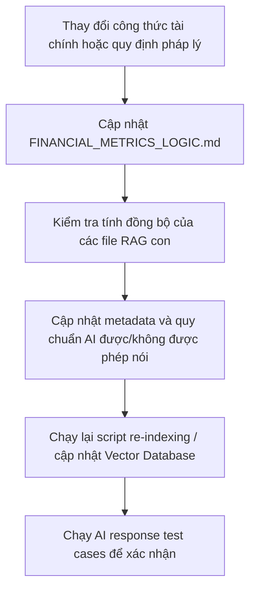

# RAG_KNOWLEDGE_BASE.md - Tổng Quan & Quy Chuẩn Kho Tri Thức RAG

## RAG Ingestion Safety — Negative Examples
> [!IMPORTANT]
> Các ví dụ sai, test case lỗi, hoặc câu nói bị cấm trong tài liệu này và các tài liệu con là **Negative Examples** (Ví dụ tiêu cực). 
> Khi hệ thống RAG xử lý và nạp dữ liệu (ingestion), phải cấu hình bộ phân tách dữ liệu (chunker) để gắn nhãn rõ ràng hoặc loại trừ các ví dụ này, đảm bảo AI không nhầm lẫn chúng thành tri thức hợp lệ để trả lời người dùng.

---

## 1. Mục Tiêu Của RAG Trong Hệ Thống
Hệ thống RAG (Retrieval-Augmented Generation) của Atelier Finance được thiết kế để cung cấp tri thức tài chính đồng bộ, chính xác cho AI Assistant. 

Mục tiêu chính bao gồm:
*   **Chống ảo tưởng (Hallucination Prevention):** Giới hạn phạm vi tri thức của AI trong các khái niệm tài chính đã được chuẩn hóa bởi Atelier Finance.
*   **Kiểm soát an toàn tại nguồn (Data-level Safety):** Định nghĩa cụ thể hành vi *"AI được phép nói"* và *"AI không được phép nói"* cho từng thuật ngữ, hỗ trợ thực thi luật an toàn [AI_GUARDRAILS.md](file:///c:/Users/ADMIN/Documents/Codex/2026-06-03/l-m-th-n-o-c/outputs/docs/ai/AI_GUARDRAILS.md).
*   **Đơn giản hóa cho người mới:** Cung cấp sẵn các định nghĩa trực quan, ẩn dụ dễ hiểu để AI truyền tải đến người dùng theo đúng [AI_RESPONSE_STYLE.md](file:///c:/Users/ADMIN/Documents/Codex/2026-06-03/l-m-th-n-o-c/outputs/docs/ai/AI_RESPONSE_STYLE.md).

---

## 2. Bản Đồ Kho Tri Thức Con (Child Knowledge Files)
Kho tri thức RAG của hệ thống được chia thành các tài liệu con chuyên biệt và tài liệu quản trị hỗ trợ:

*   [RAG_FINANCIAL_TERMS.md](file:///c:/Users/ADMIN/Documents/Codex/2026-06-03/l-m-th-n-o-c/outputs/docs/rag/RAG_FINANCIAL_TERMS.md)
    *   *Vai trò:* Định nghĩa toàn bộ các thuật ngữ tài chính cơ bản, các tài khoản trên Báo cáo kết quả kinh doanh, Bảng cân đối kế toán và Báo cáo lưu chuyển tiền tệ.
*   [RAG_VALUATION_KNOWLEDGE.md](file:///c:/Users/ADMIN/Documents/Codex/2026-06-03/l-m-th-n-o-c/outputs/docs/rag/RAG_VALUATION_KNOWLEDGE.md)
    *   *Vai trò:* Lưu trữ tri thức về định giá tương đối (P/E, P/B, P/S, EV/EBITDA), định giá nội tại (DCF, DDM) và cách diễn giải vùng giá trị hợp lý (Bear/Base/Bull), biên an toàn.
*   [RAG_RISK_KNOWLEDGE.md](file:///c:/Users/ADMIN/Documents/Codex/2026-06-03/l-m-th-n-o-c/outputs/docs/rag/RAG_RISK_KNOWLEDGE.md)
    *   *Vai trò:* Chứa tri thức phân tích rủi ro tài chính, rủi ro chất lượng lợi nhuận (lệch dòng tiền), rủi ro đòn bẩy và rủi ro thanh khoản.
*   [RAG_CHECKLIST_KNOWLEDGE.md](file:///c:/Users/ADMIN/Documents/Codex/2026-06-03/l-m-th-n-o-c/outputs/docs/rag/RAG_CHECKLIST_KNOWLEDGE.md)
    *   *Vai trò:* Cung cấp bộ khung câu hỏi phản biện, hỗ trợ AI đặt câu hỏi giúp người dùng tự kiểm tra lại các giả định và luận điểm cá nhân.
*   [RAG_PVT_KNOWLEDGE.md](file:///c:/Users/ADMIN/Documents/Codex/2026-06-03/l-m-th-n-o-c/outputs/docs/rag/RAG_PVT_KNOWLEDGE.md)
    *   *Purpose:* Explain Price Volume Time, trading value, volume, liquidity, and liquidity risk as market observation.
    *   *Must not:* Be used for buy/sell/hold, entry/exit signal, or price prediction.
*   [RAG_FINANCIAL_STATEMENTS_GUIDE.md](file:///c:/Users/ADMIN/Documents/Codex/2026-06-03/l-m-th-n-o-c/outputs/docs/rag/RAG_FINANCIAL_STATEMENTS_GUIDE.md)
    *   *Purpose:* Explain how to read income statement, balance sheet, and cash flow statement as a connected system.
    *   *Must not:* Replace metric-specific definitions in [RAG_FINANCIAL_TERMS.md](file:///c:/Users/ADMIN/Documents/Codex/2026-06-03/l-m-th-n-o-c/outputs/docs/rag/RAG_FINANCIAL_TERMS.md).
*   [RAG_DOCUMENT_TEMPLATE.md](file:///c:/Users/ADMIN/Documents/Codex/2026-06-03/l-m-th-n-o-c/outputs/docs/rag/RAG_DOCUMENT_TEMPLATE.md)
    *   *Purpose:* Define the standard structure for future RAG documents.
    *   *Usage:* Used for maintainability, not direct financial explanation.
*   [RAG_METADATA_STANDARD.md](file:///c:/Users/ADMIN/Documents/Codex/2026-06-03/l-m-th-n-o-c/outputs/docs/rag/RAG_METADATA_STANDARD.md)
    *   *Purpose:* Define metadata fields for RAG indexing and retrieval.
    *   *Usage:* Used for retrieval quality and document governance.

---

## 3. Nguyên Tắc Viết Tài Liệu RAG (Writing Principles)
Để hệ thống vector hóa (embedding) và truy xuất dữ liệu hiệu quả, mọi tài liệu tri thức RAG cần tuân thủ các nguyên tắc sau:

1.  **Cấu trúc Modular:** Mỗi thuật ngữ hoặc khái niệm phải được viết thành một khối độc lập, có tiêu đề và mã định danh (ID) rõ ràng.
2.  **Ranh giới hành vi rõ ràng:** Bắt buộc phải có hai phần riêng biệt `AI được phép nói` và `AI không được phép nói` cho mỗi khái niệm để định hình hành vi phản hồi của AI.
3.  **Cross-reference thống nhất:** Không tự ý viết lại các công thức toán học hoặc logic tính toán chỉ số, thay vào đó hãy liên kết trực tiếp tới [FINANCIAL_METRICS_LOGIC.md](file:///c:/Users/ADMIN/Documents/Codex/2026-06-03/l-m-th-n-o-c/outputs/docs/financial-logic/FINANCIAL_METRICS_LOGIC.md).

---

## 4. Quy Chuẩn Metadata & Tagging (Metadata Standards)
Mỗi khối tri thức (chunk) tài chính được định nghĩa trong tài liệu con bắt buộc phải chứa phần Metadata chuẩn dưới đây để tối ưu hóa việc đánh chỉ mục (indexing):

```txt
ID: [Mã duy nhất, ví dụ: TERM_001, VAL_002, RISK_003]
Tên thuật ngữ: [Tên tiếng Việt, Tên tiếng Anh]
Module liên quan: [Tên các module thụ hưởng, ví dụ: overview, financials, risk]
Tags: [Danh sách từ khóa ngắn để tìm kiếm semantic search]
Mức độ: [beginner | intermediate | advanced]
```

### Quy chuẩn Tagging:
*   **Đơn giản, viết thường, ngăn cách bằng dấu phẩy.**
*   **Chứa tên chỉ số và viết tắt:** (ví dụ: `roe`, `return_on_equity`, `margin`).
*   **Chứa nhãn báo cáo tài chính liên quan:** `income_statement`, `balance_sheet`, `cash_flow`.
*   **Gắn tag phân cấp độ người dùng:** `beginner` (cho người mới), `intermediate` (đã biết cơ bản), `advanced` (chuyên sâu).

---

## 5. Quy Trình Bảo Trì Kho Tri Thức RAG (Maintenance Process)
Kho tri thức RAG là tài liệu động và cần được bảo trì định kỳ theo quy trình sau:



> [!CAUTION]
> Khi thay đổi nội dung trong các file tri thức con, bắt buộc phải cập nhật lại Vector Database của hệ thống RAG để tránh hiện tượng AI trả lời bằng tri thức cũ (Outdated Knowledge).

---

## 6. Mối Quan Hệ Giữa RAG Và AI Guardrails
Hệ thống RAG hoạt động phối hợp chặt chẽ với Guardrails để bảo vệ tính an toàn của câu trả lời:

*   **RAG là bộ lọc tri thức đầu vào (Input filtering):** RAG đảm bảo context được truyền cho AI chỉ chứa thông tin hợp lệ, trung lập về mặt tài chính và đã loại trừ các từ ngữ khuyến nghị.
*   **Hỗ trợ kiểm soát hành vi:** Nhờ metadata và các phân định rõ ràng về hành vi được/cấm nói trong từng khối RAG con, AI sẽ tự giới hạn phạm vi sinh ngôn từ nguồn context an toàn này, giúp giảm tải việc phải xử lý quá nhiều luật cứng ở lớp system prompt chính.
