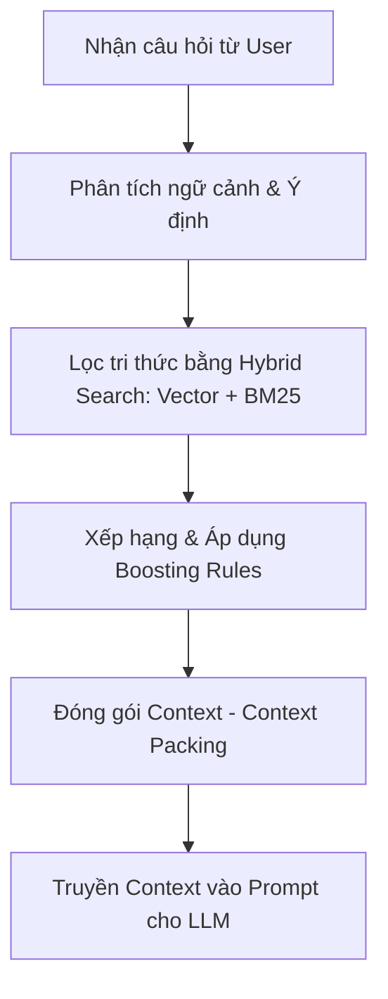

# RAG_RETRIEVAL_RULES.md - Logic & Quy Tắc Truy Xuất RAG

## 1. Giới thiệu & Vai trò
Tài liệu này định nghĩa logic truy xuất (retrieval rules) của hệ thống RAG trong Atelier Finance. 

Quy trình này chịu trách nhiệm phân tích câu hỏi của người dùng, xác định ý định, lọc và xếp hạng tri thức phù hợp từ kho RAG con, sau đó đóng gói context trước khi gửi đến AI Assistant.

> [!IMPORTANT]
> **Cross-Reference:** 
> *   Xem sơ đồ kho tri thức tại [RAG_KNOWLEDGE_BASE.md](file:///c:/Users/ADMIN/Documents/Codex/2026-06-03/l-m-th-n-o-c/outputs/docs/rag/RAG_KNOWLEDGE_BASE.md).
> *   Xem luật cấm tư vấn đầu tư tại [AI_GUARDRAILS.md](file:///c:/Users/ADMIN/Documents/Codex/2026-06-03/l-m-th-n-o-c/outputs/docs/ai/AI_GUARDRAILS.md).

---

## 2. Quy Trình Truy Xuất RAG (Retrieval Pipeline)
Mỗi truy vấn từ người dùng đi qua luồng xử lý sau:



---

## 3. Nhận Diện Ngữ Cảnh & Ý Định (Intent & Context Detection)
Trước khi tìm kiếm trong cơ sở dữ liệu Vector, hệ thống phải phân tích các chiều thông tin sau từ truy vấn:

### 3.1. Nhận diện ý định (Intent Detection)
*   **Hỏi định nghĩa (Definition Intent):** Hỏi khái niệm tài chính hoặc cách tính chỉ số (ví dụ: *"ROE là gì?"*).
*   **Hỏi dữ liệu doanh nghiệp (Data Explanation Intent):** Hỏi về một mã cổ phiếu cụ thể (ví dụ: *"Doanh thu của HPG tăng hay giảm?"*).
*   **Hỏi phản biện rủi ro (Risk Challenge Intent):** Nhận định vội vàng cần phản biện (ví dụ: *"P/E thấp là rẻ đúng không?"*).
*   **Xin khuyến nghị (Advice Intent):** Hỏi nên mua, bán, nắm giữ (ví dụ: *"Có nên mua VCB giá này không?"*).

### 3.2. Nhận diện module hiện tại (Current Module Detection)
*   Hệ thống đọc tham số `moduleKey` từ router hiện tại (ví dụ: `overview`, `financials`, `valuation`, `risk`, `checklist`).
*   **Luật:** Tài liệu thuộc module hiện tại sẽ được cộng điểm ưu tiên để hiển thị câu trả lời phù hợp nhất với màn hình người dùng đang xem.

### 3.3. Nhận diện chỉ số tài chính (Metric Detection)
*   Trích xuất các thực thể chỉ số (Entity Extraction) như: `ROE`, `ROA`, `PE`, `PB`, `CFO`, `Debt`, `Revenue` thông qua danh sách Tag và ID có sẵn trong [RAG_FINANCIAL_TERMS.md](file:///c:/Users/ADMIN/Documents/Codex/2026-06-03/l-m-th-n-o-c/outputs/docs/rag/RAG_FINANCIAL_TERMS.md).

### 3.4. Nhận diện dữ liệu thiếu (Missing Data Detection)
*   Nếu API truyền vào trạng thái dữ liệu có chứa nhãn `missing` hoặc `low_confidence`, hệ thống RAG tự động kích hoạt truy xuất các hướng dẫn xử lý thiếu dữ liệu tương ứng.

### 3.5. Nhận diện rủi ro an toàn (Safety Risk Detection)
*   Khi phát hiện câu hỏi chứa từ khóa nhạy cảm liên quan đến mua bán, bắt đáy, all-in, hệ thống bắt buộc phải truy xuất tài liệu từ chối khuyến nghị đầu tư để ghim vào context.

### 3.6. Nhận diện Price Volume Time (PVT Intent)
Khi user hỏi về giá, volume, khối lượng giao dịch, giá trị giao dịch, thanh khoản, breakout, biến động ngắn hạn hoặc hành vi giá theo thời gian:

```text
Primary retrieval:
- docs/rag/RAG_PVT_KNOWLEDGE.md
```

Nếu câu hỏi biến PVT thành tín hiệu mua/bán, điểm vào/ra, xác nhận breakout, dự đoán giá hoặc kết luận cổ phiếu an toàn:

```text
Additional safety retrieval:
- docs/ai/AI_GUARDRAILS.md
- docs/rag/AI_RAG_SYSTEM_PROMPT.md
- docs/rag/AI_HALLUCINATION_CHECKLIST.md
```

PVT context chỉ được dùng để giải thích quan sát thị trường. Không dùng PVT để tạo buy/sell/hold, entry/exit signal, hoặc price prediction.

### 3.7. Nhận diện Financial Statements Intent
Khi user hỏi về doanh thu, lợi nhuận, biên lợi nhuận, dòng tiền, bảng cân đối, tài sản, nợ vay, vốn chủ sở hữu, CFO, hoặc cách đọc báo cáo tài chính:

```text
Primary retrieval:
- docs/rag/RAG_FINANCIAL_STATEMENTS_GUIDE.md
```

Nếu user hỏi định nghĩa hoặc cách tính một chỉ số cụ thể:

```text
Additional retrieval:
- docs/rag/RAG_FINANCIAL_TERMS.md
```

Nếu câu hỏi có nợ vay, dòng tiền âm, vốn chủ âm, EPS âm, denominator không hợp lệ, hoặc sector tài chính:

```text
Additional safety/risk retrieval:
- docs/rag/RAG_RISK_KNOWLEDGE.md
- docs/rag/AI_HALLUCINATION_CHECKLIST.md
```

Financial statement context phải được đọc như một hệ thống ba báo cáo, không thay thế định nghĩa chỉ số chi tiết trong `RAG_FINANCIAL_TERMS.md`.

### 3.8. Nhận diện maintainer/developer RAG document intent
Khi user hoặc maintainer yêu cầu tạo, chuẩn hóa, review, hoặc cập nhật file RAG:

```text
Primary retrieval:
- docs/rag/RAG_DOCUMENT_TEMPLATE.md
- docs/rag/RAG_METADATA_STANDARD.md
```

Hai tài liệu này chủ yếu phục vụ developer/maintainer. Không retrieve `RAG_DOCUMENT_TEMPLATE.md` hoặc `RAG_METADATA_STANDARD.md` cho câu hỏi tài chính thông thường của người dùng cuối, trừ khi câu hỏi trực tiếp liên quan đến cấu trúc tài liệu, metadata, indexing, hoặc governance.

---

## 4. Thuật Toán Xếp Hạng & Chọn Lọc Tài Liệu (Ranking & Boosting)
Để đảm bảo các chunk tài liệu hữu ích nhất được xếp lên đầu, hệ thống áp dụng cơ chế **Hybrid Search** và **Boosting** như sau:

### 4.1. Hybrid Search Formula
$$Score = \alpha \cdot Score_{Dense} + (1 - \alpha) \cdot Score_{Sparse}$$
*   Trong đó: $\alpha = 0.7$ (ưu tiên tìm kiếm ngữ nghĩa Dense Vector), $1 - \alpha = 0.3$ (kết hợp khớp từ khóa chính xác BM25).

### 4.2. Quy tắc tăng điểm ưu tiên (Boosting Rules)
Điểm số cuối cùng của mỗi chunk tri thức được nhân với các hệ số điều chỉnh:

| Điều kiện khớp | Hệ số nhân (Boost Factor) | Giải thích |
| :--- | :--- | :--- |
| Khớp `Module liên quan` của tài liệu với màn hình hiện tại | **1.3** | Ưu tiên tri thức đúng với màn hình người dùng đang xem. |
| Khớp `Tags` chính xác với thực thể chỉ số trong câu hỏi | **1.2** | Ưu tiên tri thức định nghĩa đúng chỉ số người dùng hỏi. |
| Có cảnh báo biên tài chính đặc biệt (EPS âm, Vốn chủ âm) | **Ghim lên đầu (Pin to Top)** | Bắt buộc AI phải đọc cảnh báo giới hạn chỉ số trước. |

---

## 5. Đóng Gói Context (Context Packing Rules)
Do hiển thị trên sidebar hẹp của Atelier Finance, context truyền vào LLM cần được tinh lọc kỹ lưỡng:

*   **Giới hạn Token:** Tổng dung lượng RAG context không vượt quá **1500 tokens** (tương đương tối đa 3-4 chunks chất lượng nhất).
*   **Cấu trúc đóng gói context mẫu:**
    ```markdown
    [RAG Context Khởi Tạo]
    - Ticker: AAA | Module: Valuation
    - Dữ liệu thiếu ghi nhận từ hệ thống: total_equity (Vốn chủ sở hữu)
    
    [Tri Thức Trích Xuất]
    - ID: TERM_009 (Vốn chủ sở hữu)
      Định nghĩa ngắn: ...
      Cảnh báo an toàn: Vốn chủ sở hữu âm hoặc thiếu làm méo mó ROE và P/B.
    ```

---

## 6. Chiến Lược Xử Lý Khi Không Tìm Thấy Tài Liệu (Fallback Strategy)
Nếu điểm số của tất cả các chunk trích xuất đều nằm dưới ngưỡng an toàn tối thiểu ($Score < 0.60$):

1.  **Tuyệt đối không bịa thông tin:** Không tự suy diễn các số liệu hoặc đặc điểm mô hình kinh doanh của doanh nghiệp ngoài context.
2.  **Kích hoạt câu trả lời Fallback tiêu chuẩn:** 
    *"Hiện tại kho tri thức của hệ thống chưa có thông tin chi tiết về nội dung này. Tôi có thể giúp bạn giải thích các chỉ số tài chính cơ bản hoặc hướng dẫn bạn cách phân tích báo cáo tài chính..."*

---

## 7. Các Test Case Kiểm Thử Truy Xuất (Retrieval Test Cases)

### Test Case 1: Hỏi mua bán khi đang ở module Tổng quan
*   **Input Query:** *"Mã này đang ở vùng giá thấp, tôi có nên mua gom không?"*
*   **Context:** `moduleKey = overview`, `ticker = MWG`
*   **Expected Retrieval Output:** Hệ thống RAG phải trả về chunk từ chối khuyến nghị mua bán ([AI_GUARDRAILS.md - Section 2](file:///c:/Users/ADMIN/Documents/Codex/2026-06-03/l-m-th-n-o-c/outputs/docs/ai/AI_GUARDRAILS.md#L12-L29)) làm tài liệu ưu tiên số 1.

### Test Case 2: Hỏi định giá của một doanh nghiệp có EPS âm
*   **Input Query:** *"Chỉ số P/E của mã này hiện tại là bao nhiêu, định giá có hấp dẫn không?"*
*   **Context:** `moduleKey = valuation`, `ticker = AAA`, `eps = -1500`
*   **Expected Retrieval Output:** Hệ thống phải tự động ghim chunk cảnh báo giới hạn của P/E khi EPS âm ([RAG_VALUATION_KNOWLEDGE.md](file:///c:/Users/ADMIN/Documents/Codex/2026-06-03/l-m-th-n-o-c/outputs/docs/rag/RAG_VALUATION_KNOWLEDGE.md)) lên đầu tiên để AI nhận diện và cảnh báo.

### Test Case 3: Hỏi chéo module (Đang ở module Rủi ro nhưng hỏi khái niệm ROE)
*   **Input Query:** *"Giải thích giúp tôi chỉ số ROE là gì và đọc thế nào?"*
*   **Context:** `moduleKey = risk`, `ticker = BBB`
*   **Expected Retrieval Output:** 
    *   Hệ thống RAG trích xuất chunk định nghĩa ROE từ [RAG_FINANCIAL_TERMS.md](file:///c:/Users/ADMIN/Documents/Codex/2026-06-03/l-m-th-n-o-c/outputs/docs/rag/RAG_FINANCIAL_TERMS.md).
    *   Đồng thời, vì người dùng đang ở module Rủi ro, hệ thống trích xuất và ưu tiên thêm chunk về rủi ro bóp méo ROE khi nợ vay cao từ [RAG_RISK_KNOWLEDGE.md](file:///c:/Users/ADMIN/Documents/Codex/2026-06-03/l-m-th-n-o-c/outputs/docs/rag/RAG_RISK_KNOWLEDGE.md).
